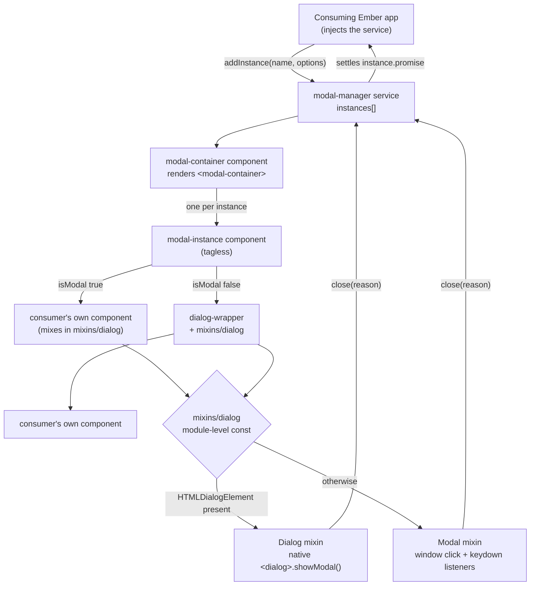

# Checkpoint Modal (`ember-addon-modal`)

> _An Ember CLI addon providing a modal/dialog stack — a service that opens named modals, a container that renders them, and a mixin that turns any component into a modal._

- **Type:** Library (Ember CLI addon). Nothing in this repository is deployed.
- **Purpose:** Give a consuming Ember application a promise-based modal API: inject the `modal-manager` service, call `addInstance(name, options)`, and `await` the returned promise for the modal's result.
- **Status:** Dormant. The library code last changed in January 2021; the only change since is a June 2026 Node-runtime pin. It has never been published to a registry, and the only way a change here can reach a consumer is for someone to move the git ref that consumer pins.

---

## Name chain

| Link | Value |
|---|---|
| Repo | `ember-addon-modal` |
| `package.json` `name` | `checkpoint-modal` — **differs from the repo name, and the difference is load-bearing:** it is the Ember module namespace, so every `import` path and any dependency key must use `checkpoint-modal` |
| Serverless `service:` / ECR image | none — library; no Serverless config, Dockerfile, compose file, manifest or CDK app has ever been committed at any ref |
| CloudFormation stack | none — library; nothing is provisioned |
| Deployed K8s workload (kind + name) / Lambda function | none — library; it runs inside whichever Ember application imports it, so its runtime identity is that application's |
| Event-source names | none — not invoked. A genuine `none` rather than `unknowable`: there is no scheduler, rule or subscription of any kind at any ref |
| Public host / API Gateway id | none — library; no hostname, URL or ARN appears anywhere in this repository at any ref |
| CDN distribution id | none — library; nothing is served |
| Other runtime labels | Ember module namespace `checkpoint-modal` (root `index.js` registers the addon under `require('./package').name`); custom element tag names `<modal-container>`, `<dialog>` and `<modal>`; CSS class names `cgg-dialog`, `cgg-modal`, and `is-open` bound to the `Modal` mixin's `show`. Tag `v0.0.1` |

---

## Architecture Context

| Field | Detail |
|---|---|
| Part of | Front-end shared code (Ember) |
| Role in Platform | UI component library. It contributes components, a service and mixins into a consuming Ember application's own module resolution; it has no process, no runtime and no address of its own. |
| Upstream Dependencies | The consuming Ember application, which supplies the resolver, the router, the runloop, the templates rendered inside the modal, and the CSS for `cgg-dialog` / `cgg-modal`. Runtime peers are `@ember/component`, `@ember/object`, `@ember/service`, `@ember/runloop`, `@ember/application` (from `ember-source`) and `@glimmer/tracking` — see *Consuming this addon* for the constraint that last one imposes. Build-time dependencies are `ember-cli-babel` and `ember-cli-htmlbars`. |
| Downstream Dependencies | None. This addon makes no network call, opens no connection and names no datastore, bucket, queue or API. |

Architecture docs: https://docs.geeiq.com/architecture/

---

## What it offers — export inventory

Anything under `addon/` is importable as `checkpoint-modal/<path>`; anything with a matching
re-export under `app/` is additionally resolvable by name in a consuming application's templates
and injections.

| Module | Import path | `app/` re-export | What it is for |
|---|---|---|---|
| `services/modal-manager` | `checkpoint-modal/services/modal-manager` | **absent — see *Consuming this addon*** | The stack. `addInstance(name, args)` pushes a modal instance and returns it; `removeInstance(instance, success, data, reason)` pops it after running its close listeners; `getInstance(name)` finds one by `uuid` then by `name`. Tracks an `instances` array. Each instance carries `name`, `options`, an incrementing `uuid`, a `promise` that settles when the modal closes, `addCloseListener`/`removeCloseListener`, `closeable`, and `close(success, data, reason)`. |
| `components/modal-container` | `checkpoint-modal/components/modal-container` | `app/components/modal-container.js` | Renders one `modal-instance` per entry in `modalManager.instances`, as a `<modal-container>` element. Place it once in the application template; it injects the `modalManager` service and aliases `modalInstances` from it. |
| `components/modal-instance` | `checkpoint-modal/components/modal-instance` | `app/components/modal-instance.js` | Tagless wrapper for one open modal. Positional params `modalName`, `options`, `uuid`. Its `isModal` property looks the named component up through `getOwner(this).factoryFor` and reports whether that component already mixes in the overlay mixin; if it does, the component is rendered directly, and if it does not, it is wrapped in `dialog-wrapper`. |
| `components/dialog-wrapper` | `checkpoint-modal/components/dialog-wrapper` | `app/components/dialog-wrapper.js` | Overlay chrome for a component that is not itself a modal. Mixes in the overlay mixin, defaults `autoOpen` to `true`, and yields into a single `<div>`. |
| `mixins/dialog` (default export `Overlay`) | `checkpoint-modal/mixins/dialog` | n/a — mixins are imported by path | **The main extension point.** Mix it into your own component to make that component a modal. Also exports the two concrete mixins it chooses between, `Dialog` and `Modal`, and the helper `checkTargetAndElementCoords({element, event})`. Provides `show`, `autoOpen`, `isModalMixin`, `openModal()`, `closeModal(reason)` and click-outside / Escape dismissal. |
| `mixins/modal-attrs` | `checkpoint-modal/mixins/modal-attrs` | n/a | Included by the overlay mixin. On `didReceiveAttrs`, if the component is inside a `modal-container` and was passed a `modalOptions` object, it defines an aliased property on the component for each key of that object — so `addInstance('my-modal', {userId: 3})` surfaces as `this.userId` on the rendered component. |
| `enum` | `checkpoint-modal/enum` | n/a | `CLOSE_REASON_BACKGROUND` (`'background'`), `CLOSE_REASON_ESCAPE` (`'escape'`), `CLOSE_REASON_SERVICE` (`'service'`), plus a default export holding all three. Passed as the `reason` argument through the close path. |
| `index` | `checkpoint-modal` | n/a | A single module-level options object, `{ disableDialogSupport: false }`. See *Configuration*. |
| `templates/components/*.hbs` | — | — | Layouts for the three components, assigned via `layout` rather than resolved by name. |

Root `index.js` is the Ember CLI addon entry point and is the five-line blueprint default: it
declares `name` and nothing else. There is no `config(env, baseConfig)` hook, no `included()`, no
`contentFor()`, no `treeFor*` hook and no `isDevelopingAddon()` override, so the addon takes part
in a consuming build with entirely default behaviour and leaves the consumer's tree caching
intact.

---

## How It Works

The overlay mixin picks its implementation **once, at module evaluation time**, from a
module-level `const`:

- If the browser has `HTMLDialogElement.prototype.showModal`, the `Dialog` mixin is used. It
  renders a native `<dialog class="cgg-dialog">`, opens it with `element.showModal()`, closes it
  with `element.close()`, and dismisses on a click whose coordinates fall outside the element's
  bounding box.
- Otherwise the `Modal` mixin is used. It renders a `<modal class="cgg-modal">` whose `is-open`
  class is bound to `show`, and binds capture-phase `click` and `keydown` listeners on `window`
  for click-outside and Escape dismissal, unbinding them on `willDestroyElement`.

Because the choice is a `const` evaluated when `mixins/dialog` is first imported, it is fixed for
the lifetime of the page and identical for every modal in the application.



---

## Consuming this addon

There is no published package. A consumer therefore installs from git, and the dependency **key**
must be the package name, not the repo name:

```json
"checkpoint-modal": "git+ssh://git@github.com/CheckpointGG/ember-addon-modal.git#master"
```

Then, once in the application template:

```hbs
{{modal-container}}
```

and in a route or component:

```js
modalManager: service(),

async openThing() {
  let instance = this.modalManager.addInstance('my-thing-modal', { thingId: 3 });
  try {
    let result = await instance.promise;
  } catch (e) {
    // see below — the promise rejects on a UI-driven close
  }
}
```

Three properties of the current code that a consumer meets in its own build or browser rather
than here, and which are the reason this addon should be treated as unproven:

- **`app/services/modal-manager.js` does not exist and never has**, at any ref. Ember resolves an
  addon's services through its `app/` re-exports, so `modalManager: service()` inside
  `components/modal-container` has no `service:modal-manager` to resolve against in a consuming
  application. The service module was added in the first content commit (2019-10-31) at the same
  time as the three `app/components/*` re-exports, and no `app/services/` file was created with
  it. A consumer that renders `{{modal-container}}` therefore has to register the service itself,
  or add the missing re-export.
- **`@glimmer/tracking` is imported by `services/modal-manager` and is declared nowhere.** It
  appears in no `dependencies`, `devDependencies`, `package-lock.json` or `yarn.lock` entry at any
  ref, and `ember-source` here is pinned `~3.11.1`, which predates the version that began
  providing that module. Resolution therefore depends entirely on what the consuming application
  already has installed.
- **`instances` and `closeListeners` are plain arrays, and the code calls `pushObject` /
  `removeObject` on them.** Those come from Ember's array prototype extensions, and this repo's
  own dev dependencies include `ember-disable-prototype-extensions` — so the calls work only in a
  consumer that leaves prototype extensions enabled.

And one behaviour worth knowing before you `await` the promise: `modal-container`'s `modalClosed`
action calls `removeInstance(modalInstance, null, null, reason)`. `success` is `null`, so
`didClose` takes its `else` branch and **rejects** the instance's promise. Every close driven by
the UI — background click or Escape — therefore rejects, while a programmatic `instance.close()`
defaults `success` to `true` and resolves. A consumer that does not attach a rejection handler
gets an unhandled rejection on an ordinary dismissal.

---

## Setup & Usage

### Requirements

- Node.js — `.nvmrc` and `engines.node` both say 10. Note `.travis.yml` declares Node 8; see *Testing*.
- Yarn or npm. Both `yarn.lock` and `package-lock.json` are committed.
- Ember CLI. `package.json` pins `ember-cli ~3.11.0` and `ember-source ~3.11.1` as dev dependencies. The compatibility range this README previously advertised (Ember 3.4+, Ember CLI 2.13+, Node 8+) was the blueprint's default text and has never been checked against this code, which uses `@glimmer/tracking` and native `<dialog>`.

### Local Development

```bash
git clone git@github.com:CheckpointGG/ember-addon-modal.git
cd ember-addon-modal
yarn install
ember serve            # serves tests/dummy at http://localhost:4200
```

`tests/dummy` is the blueprint's placeholder application: its `application.hbs` and routes are
empty, so `ember serve` boots an app that renders nothing. Exercising the addon means adding a
modal component and a `{{modal-container}}` to the dummy app first.

---

## Triggers

**None — this is a library, and a library is not invoked.** There is no HTTP route, schedule,
queue consumer, Lambda handler or CLI entry point at any ref. What replaces the trigger list is
the import surface above: `import X from 'checkpoint-modal/<path>'` for anything under `addon/`,
plus name resolution (`{{modal-container}}`, `service()`) for anything with a matching `app/`
re-export.

---

## Services & Data Access

**No datastore access, and this is the accurate answer rather than an unchecked one.** Per the
library rule, the access belongs to whoever calls the library — but here there is nothing even to
attribute onward: this repository contains no table, collection, bucket prefix, index, cache key,
SQL statement, HTTP request, hostname, URL or ARN at any ref. Every value the addon handles is
supplied by the consuming application as a component attribute or a service argument, and every
value it produces is handed back to that application in memory.

### How requests are authenticated

n/a — this addon issues no requests, so it holds and attaches no credential.

---

## Outputs & Side Effects

- **Mutates the consuming application's DOM.** Inserts a `<modal-container>` element and, per open
  modal, either a native `<dialog class="cgg-dialog">` or a `<modal class="cgg-modal">`. Calls
  `showModal()` / `close()` on the native dialog element.
- **Registers capture-phase `click` and `keydown` listeners on `window`** for the duration of an
  open modal, in the `Modal` (non-native-dialog) path. Removed on `willDestroyElement`.
- **Defines properties on the consumer's component instance at runtime.** `mixins/modal-attrs`
  calls `defineProperty` for each key of the `modalOptions` object it was passed, aliasing them
  onto the component.
- **Settles a promise the consumer holds**, resolving with the modal's result data or rejecting
  with it — this is the addon's primary product.

---

## Deployment

**No deployment — nothing here is deployed, and nothing is published either.**

There is no release procedure to invoke:

- No registry artefact. Neither `checkpoint-modal` nor `ember-addon-modal` is registered on the
  public npm registry, so the name is free rather than taken by an upstream project.
- `package.json` has no `publishConfig`, no `files` array and no `private` flag, and no
  `prepare` / `prepublish` / `prepublishOnly` script. `version` is `0.0.0` and has never moved in
  ten commits.
- No publish workflow exists at any ref. There is no `.github/` directory anywhere in this
  repository's history.
- The one tag, `v0.0.1`, is a lightweight tag created in June 2026 on the Node-pinning merge
  commit. It is wired to nothing, and it disagrees with `package.json`, which says `0.0.0` at that
  commit.

So the only way a change here reaches a consumer is for someone to move the git ref that consumer
pins. `.npmignore` is present and would govern a hypothetical tarball: it excludes `tests/`,
`config/ember-try.js`, `ember-cli-build.js`, `testem.js`, `yarn.lock` and the dotfiles, and keeps
`addon/`, `app/`, `config/environment.js` and root `index.js`. The entry point that `index.js`
resolves to exists.

---

## Configuration

**No environment variables, and none are readable.** `process.env` appears nowhere in `addon/`,
`app/` or root `index.js`; the only occurrences in the repository are in `testem.js` and
`tests/dummy/config/targets.js`, which are test scaffolding. `config/environment.js` is the
blueprint default — `module.exports = function() { return { }; };` — so this addon contributes
nothing into a consuming application's `ENV` and nothing of its own reaches the
`<meta name="…/config/environment">` tag in a consuming application's built `index.html`.

The addon's only configuration surface is `addon/index.js`:

```js
let options = {
    disableDialogSupport: false,
};
```

`mixins/dialog` reads `options.disableDialogSupport` when the module is first evaluated, to force
the `Modal` path on browsers that do have a native `<dialog>`. It is a hard-coded module-level
value with no consumer-facing route to change it — there is no `config()` hook, no
`config/environment.js` value and no component attribute wired to it — so as committed the `Modal`
mixin is unreachable in any browser that implements `HTMLDialogElement`.

Note also that `.gitignore` and `.npmignore` both cover `/.env*`, which would also match a
`.env.example`; there is nothing to put in one.

---

## Testing

```bash
yarn lint:hbs      # ember-template-lint
yarn lint:js       # eslint
yarn test          # ember test
yarn test:all      # ember try:each — 7 Ember scenarios from config/ember-try.js
```

- **Framework:** QUnit via `ember-qunit`.
- **Coverage:** none configured, and effectively zero. Three test files exist and all three are
  the blueprint's generated placeholders: the two integration tests assert only that
  `<ModalContainer />` and `<ModalInstance />` render empty and then render a yielded block, and
  the unit test asserts that an `EmberObject` extended with the dialog mixin is truthy. Nothing
  tests the service, the close path, the close reasons, `modal-attrs`, or the `Dialog`/`Modal`
  selection. Both integration tests render components whose dependencies are described under
  *Consuming this addon* — the missing `app/services/modal-manager.js` for `modal-container`, and
  `isModal`'s `factoryFor` lookup of a null `modalName` for `modal-instance` — so they are not
  expected to pass as written.
- **CI Status:** none, and never any. This repository has never contained a `.github/` directory
  at any ref, so there are no workflows, no runs and no releases. The only CI configuration is
  `.travis.yml`, which was written by the Ember CLI 3.11 blueprint in the initial commit and never
  edited: it declares Node 8, runs lint and `ember test` across seven `ember-try` scenarios, is
  confined by `branches.only` to `master` and `v<n>.<n>.<n>` tags, and contains no publish or
  deploy stage. No Travis result is reachable for this repository.
- **Linters:** ESLint (`.eslintrc.js`, with `eslint-plugin-ember`) and `ember-template-lint`
  (`.template-lintrc.js`) are both configured, and neither runs in any automation.

---

## Further Reading

- [CONTRIBUTING.md](./CONTRIBUTING.md) — clone, lint, test and dummy-app commands
- [CLAUDE.md](./CLAUDE.md) — how to bump the Node runtime in this repo
- [Ember CLI addon documentation](https://cli.emberjs.com/release/writing-addons/)
- [`<dialog>` on MDN](https://developer.mozilla.org/en-US/docs/Web/HTML/Element/dialog)
